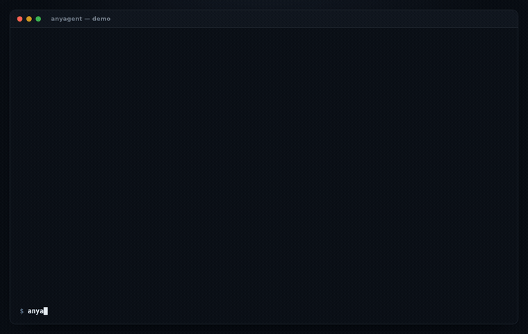
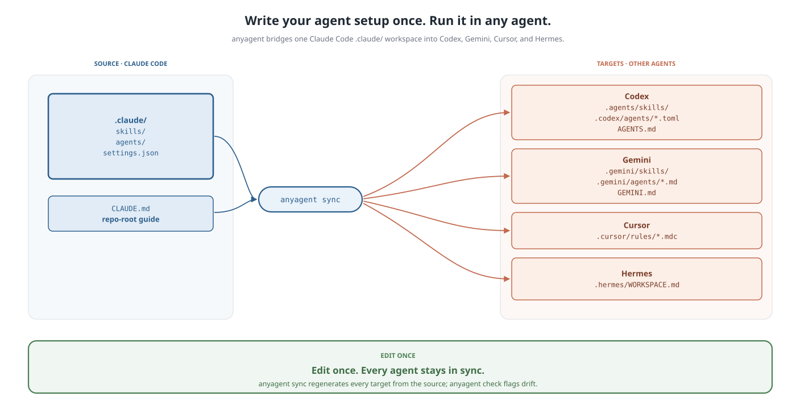

<div align="center">

# anyagent

### Write your agent setup once. Run it in any agent.

**Stop re-teaching every AI agent how you work.**

[](https://github.com/saucam/anyagent/actions/workflows/ci.yml)
[](https://www.npmjs.com/package/@saucam/anyagent)
[](LICENSE)
[](https://nodejs.org)
[](package.json)

</div>

<div align="center"></div>

---

You spent weeks building your **Claude Code** setup — skills, subagents, project rules, workspace guidance. Then you open **Codex**, **Gemini**, or **Cursor**, and every one of them starts the session half-amnesiac. So you copy-paste folders, rewrite agents in a different format, and watch them drift out of sync forever.

**anyagent** keeps your Claude Code `.claude/` workspace as the single source of truth and projects it into the native formats other agents already know how to read. One canonical setup. Every assistant. No duplicated folders, no copy-paste drift.

```bash
npx @saucam/anyagent sync --to codex gemini cursor
```

That's it. Your Claude skills now show up in Codex's `.agents/skills/`, your agents become Codex TOML / Gemini Markdown / Cursor `.mdc` rules, and your `CLAUDE.md` becomes `AGENTS.md`, `GEMINI.md`, and a Cursor workspace rule — all generated from the one workspace you already maintain.

## 30-second demo

```bash
# Tip: install once with `npm i -g @saucam/anyagent` and drop the `npx @saucam/`
# prefix below — the command is just `anyagent`.

# 1. Scaffold a canonical workspace (or use your existing .claude/)
npx @saucam/anyagent init

# 2. See exactly what anyagent can find
npx @saucam/anyagent doctor

# 3. Preview every change without touching disk
npx @saucam/anyagent plan --to codex gemini cursor

# 4. Bridge it
npx @saucam/anyagent sync --to codex gemini cursor
```

Now the *same* Claude-origin skill and reviewer agent are discoverable in Codex, Gemini, and Cursor — no rewrite, no second copy to keep in sync.

## Why this exists

AI coding tools are converging on the same **primitives** — skills, agents, rules, commands, hooks, MCP servers — but **not** on one filesystem layout or manifest format:

| Tool | Skills | Agents | Project guidance |
| ---- | ------ | ------ | ---------------- |
| Claude Code | `.claude/skills/*/SKILL.md` | `.claude/agents/*.md` | `CLAUDE.md` |
| Codex | `.agents/skills/*` | `.codex/agents/*.toml` | `AGENTS.md` |
| Gemini | `.gemini/skills/*` | `.gemini/agents/*.md` | `GEMINI.md` |
| Cursor | — (rules) | — (rules) | `.cursor/rules/*.mdc` |

The next layer of value isn't another agent. It's the **compatibility layer between agents** — so your accumulated workflow knowledge belongs to *you*, not to whichever tool you opened today.

> **Already using `AGENTS.md`?** anyagent *generates* it for you — from the `CLAUDE.md` and `.claude/` setup you already maintain — and keeps it in sync, so the standard layout and your canonical source never drift apart.

## How it works

<div align="center"></div>

- **Skills are symlinked** (relative links, so your workspace stays portable) into each target's native skill folder. Edit once, every agent sees the change instantly. (Cursor has no skill folder, so skills become `.mdc` rules; Windsurf maps them to native `/workflows`.)
- **Agents are converted** into each target's manifest — Codex TOML, Gemini/Hermes Markdown, Cursor `.mdc`, Windsurf rules — preserving the original instructions.
- **Workspace guidance is generated**: `CLAUDE.md` → `AGENTS.md` / `GEMINI.md` / `.cursor/rules/workspace.mdc` / `.windsurf/rules/workspace.md` / `.hermes/WORKSPACE.md`.
- **Lossy conversions are reported, never silent.** When a Claude-specific concept (hooks, tool policies, or Cursor/Windsurf's lack of subagents) has no native equivalent, anyagent preserves it as readable instructions and prints a `warn:` line. Trust comes from honesty.

```
$ anyagent sync --to codex
[codex] link skill
  from: .claude/skills/reviewer
  to:   .agents/skills/reviewer
[codex] converted agent
  from: .claude/agents/reviewer.md
  to:   .codex/agents/reviewer.toml
  warn: Claude agent tool and hook semantics are preserved as instructions, not native Codex policy.
[codex] generated guide
  from: CLAUDE.md
  to:   AGENTS.md

3 operation(s), 1 warning(s)
```

## Install

Run it with no install:

```bash
npx @saucam/anyagent <command>
```

Or install globally (the binary is `anyagent`):

```bash
npm install -g @saucam/anyagent
anyagent sync --to codex gemini cursor
```

Requires **Node.js ≥ 20**. Zero runtime dependencies.

## Commands

| Command | What it does |
| ------- | ------------ |
| `anyagent init` | Scaffold a starter canonical `.claude/` workspace. Never overwrites existing files. |
| `anyagent doctor` | Report every skill, agent, setting, and guide anyagent can see. |
| `anyagent plan` | Print the exact operations `sync` would perform — no writes. |
| `anyagent sync` | Bridge skills, agents, and guidance into each target. |
| `anyagent check` | Exit non-zero if any target is out of date. Writes nothing — for CI. |
| `anyagent watch` | Re-run `sync` on an interval so targets track the source. |

### Flags

| Flag | Default | Meaning |
| ---- | ------- | ------- |
| `--root <path>` | `.` | The workspace root to read from. |
| `--to <targets...>` | `codex gemini cursor hermes` | Which targets to bridge into. |
| `--copy` | off (symlink) | Copy skills instead of symlinking — for environments where symlinks aren't ideal. |
| `--dry-run` | off | Plan the work without writing anything. |
| `--check` | off | Like `sync` but writes nothing and exits non-zero on drift (alias: `anyagent check`). |
| `--interval-ms <n>` | `2000` | `watch` poll interval (min 250). |

## Keep it in sync in CI

Shared a `.claude/` setup with your team? Make drift impossible to merge. `anyagent check` exits non-zero the moment a bridged target falls behind the source:

```yaml
# .github/workflows/agents.yml
name: agents
on: [push, pull_request]
jobs:
  check:
    runs-on: ubuntu-latest
    steps:
      - uses: actions/checkout@v4
      - uses: saucam/anyagent@v1
        with:
          to: codex gemini cursor
```

```
✗ out of date — 1 artifact(s) would change:
  [cursor] generated guide: .cursor/rules/workspace.mdc

Run `anyagent sync` to update them.
```

## Design principles

- **One source of truth.** Prefer symlinks and generated files over manual copies.
- **Native discovery first.** Feed each agent the files it already knows how to load.
- **No runtime magic.** The bridge does its work before the agent starts.
- **Lossy conversions must be visible.** Never silently drop behavior.
- **Local-first.** No cloud dependency. No telemetry. Ever.
- **Boring filesystem wins.** It should feel obvious the moment you see it.

## Supported targets

| Target | Status | Notes |
| ------ | ------ | ----- |
| Codex | ✅ | Skills (symlink), agents (TOML), `AGENTS.md` |
| Gemini | ✅ | Skills (symlink), agents (Markdown), `GEMINI.md` |
| Cursor | ✅ | Skills + agents → `.cursor/rules/*.mdc`, workspace rule from `CLAUDE.md` |
| Windsurf | ✅ | Skills → `.windsurf/workflows/*.md`, agents + `CLAUDE.md` → `.windsurf/rules/*.md` |
| Hermes | ✅ | Skills (symlink), agents (Markdown), `.hermes/WORKSPACE.md` |
| Aider / OpenCode | 🔭 roadmap | — |

Want a target? [Open an issue](https://github.com/saucam/anyagent/issues/new/choose) or read [CONTRIBUTING.md](CONTRIBUTING.md) — adapters are ~40 lines and share a tested contract.

## Roadmap

- Aider and OpenCode adapters
- MCP config normalization across tools
- A hook-compatibility matrix
- Cross-agent command conversion
- `anyagent publish` — export a portable, shareable bundle

Launching it? There's ready-to-use copy in [docs/launch.md](docs/launch.md). The full vision lives in [proposal.md](proposal.md).

## Contributing

Issues and PRs welcome. The codebase is small (~600 lines), strict TypeScript, zero runtime deps, and fully tested. Start with [CONTRIBUTING.md](CONTRIBUTING.md).

```bash
git clone https://github.com/saucam/anyagent
cd anyagent
npm install
npm run build
npm test
```

## License

[MIT](LICENSE) © [Yash Datta](https://github.com/saucam)

---

<div align="center">

**Your AI workflow should belong to you, not to one assistant.**

</div>
